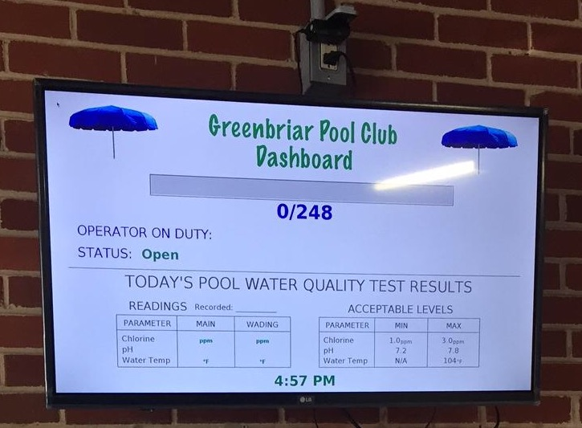
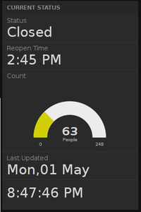
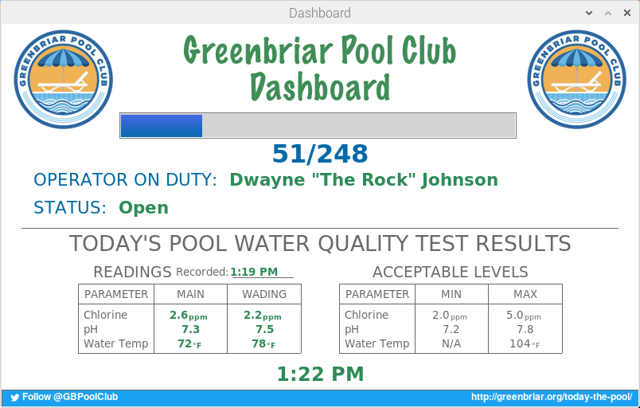
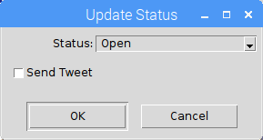
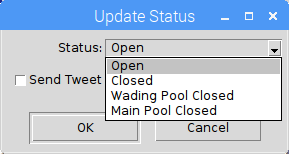
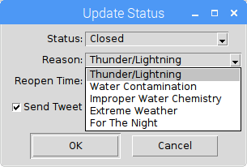
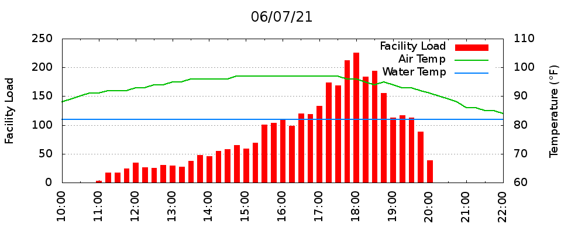

# Greenbriar Pool Club Dashboard #

This program is used by the staff at the Greenbriar Pool Club to
communicate important status information to members.  The information includes:

* The current facility load - the current facility load is displayed using
  a progress bar widget, both on a monitor at the entrance
  to the club and on the club's website.
* The most recent water quality test results - water quality data
  for both the main and wading pool are displayed on the monitor at
  the entrance to the Club.
* Unanticipated closures of either or both pools - unanticipated closures
  are communicated to the membership by sending out tweets
  and updating the status on the Club's website.

-----------------------------------------------------------------------

## Background ##

The Greenbriar Pool Club has a maximum facility load of 248 people. This
limit is set by the [Water Recreation Facilities Ordinance of Fairfax
County, Virginia](http://www.fairfaxcounty.gov/hd/eh/pools/fairfax-county-water-rec-facilities-ordinance.pdf).  According to the ordinance,

    "The maximum individual swimming pool bather load shall be determined
    by dividing the total water surface area in square feet of each swimming
    pool within the swimming pool facility by 27 square feet. The designated
    maximum individual swimming pool bather load and the maximum facility
    load shall not be exceeded. The pool operator shall be responsible for
    enforcing the maximum individual swimming pool bather load and the maximum
    facility load. The maximum facility load may be temporarily exceeded to
    allow for spectators of special events, such as recreational swimming meets
    or other water sport activities, provided that the spectators shall not
    have access to and be separated from the pool(s) both during and after the
    event."

Historically the club reaches the maximum facility load a few times each
season. The staff is required to stop admitting people into the club
once this number has been reached and is only allowed to admit new
people as others leave, resulting in a line of people outside the club
waiting to be admitted.  This program was developed to give the staff a
means to better communicate to the membership the current facility load.
As such, this program is meant to be run fullscreen using a Raspberry Pi
computer connected to a display mounted across from the front desk,
just inside the entrance to the pool club.

Once the Greenbriar Pool Club committed to obtaining internet access,
this program was modified to provide even better communication to the
membership.  Using the free service provided by
[dweet.io](https://dweet.io), this program sends data from the Raspberry
Pi to the cloud every two seconds, allowing near real-time status
information to be available for the membership to view online.  The
information sent to dweet.io was originally linked to another internet service
at [freeboard.io](https:://freeboard.io) that  provides tools for
building webpages containing dashboards used for visualizing real-time
data.  However, at some point freeboard.io stopped offering free dashboard hosting
so the webpage for the online dashboard is now hosted on a personal web server.
The information displayed on the web includes the current status,
the time the pool is scheduled to reopen if closed, the current facility
load, and the date/time the information was last updated. A link to
the online dashboard has been added to the Pool Club's webpage.

-----------------------------------------------------------------------

## Operating Instructions ##

When powered on, the Raspberry Pi connected to the display across from the
front desk is configured to automatically log in to the "guard" user
account and launch the Greenbriar Pool Club Dashboard in fullscreen
mode. The "guard" user account __does not__ have [sudo](https://en.wikipedia.org/wiki/Sudo)
privileges so the damage that can be done while logged into this account
is minimal.  The Dashboard is designed to run 24/7, but if you need to exit
the program press the Esc key.

### Facility Load ###

The front desk staff authenticates members using
[Club Sentry](http://www.clubsentry.com/index.php). Club Sentry
maintains a database of members with photographs of each family member
associated with a membership.  As people are admitted, the front desk
staff will add to the counter in Greenbriar Pool Club Dashboard and as
people leave the club they will subtract from the counter

To add to the facility load press either the "+" or right-arrow key on
the wireless keyboard connected to the Raspberry Pi.  To subtract from
the facility load press either the "-" or left-arrow key on the
keyboard. When using the "+" and "-" keys to add and subtract from the
count there is no need to hold down the shift key.  Pressing the keys
once adds or subtracts one from the facility load and the progress bar
will move to the right or left appropriately.

### Operator On Duty ###

The Dashboard has a line that displays the name of the
operator/manager currently on duty.  To set or change the name
displayed for the operator on duty simply left-click with the mouse or
touchpad on the section of the Dashboard with the words "OPERATOR ON
DUTY".  A dialog box will appear.  Enter the new name in the text box
and click OK.

### Status ###

The Dashboard also serves as a virtual open/close sign for the pool
club.  When unexpected closures occur the staff is able to inform
members using the Status section of the Dashboard.  To change the
current status of the pool club simply left-click with the mouse or
touchpad on the section of the Dashboard with the words"STATUS".  A
dialog box will appear.

Select the appropriate new status from the status drop-down list.

When changing to a "Closed" status another drop-down list will appear
that is used to select the reason the pool is closing.  The time the
pool will reopen must also be set.  The option to have the Dashboard
automatically generate and send a tweet using the pool's Twitter
account is also available. If the status is being changed
to "Closed" a tweet should be sent.  If however you are only making a
small change to the scheduled reopen time it may not be appropriate
to send another tweet.  Ultimately it is left up to the discretion of
the staff as to when it is appropriate to send a tweet.  The text of
the tweets are automatically generated based on the selected status,
reason and reopen time entered in the dialog box.  For example:

"The wading pool is closed due to water contamination and is scheduled
to reopen at 6:20 PM."

### Water Quality Test Results ###

To update the pool water quality information displayed on the Dashboard
simply left-click on the "Readings" table.  This will bring up a dialog
box in which you can enter the new water quality results.  The time is
automatically filled in with the current time, but can be adjusted if
need be.  When the water quality results have been entered click "OK"
to update the Dashboard.

### Facility Time History Log ###

The following data is logged at fifteen minute intervals, precisely
at 00, 15, 30 and 45 minutes past the hour.

* time stamp (format = mm/dd/yr hr:mn)
* count (facility load)
* status (open/closed)
* reason (thunder/lightning, poor water quality, etc.)
* reading time (last time the water quality was checked)
* main chlorine
* wading chlorine
* main ph
* wading ph
* main temp
* wading temp
* feels like air temperature
* weather condition

The log file is in the /home/guard/logs directory and the filename is
“facility_time_hist_[year].csv”, where [year] is the current four digit year.
The Dashboard will keep appending to this file all season. The file is comma
delimited and can be easily imported into Excel.

### Facility Event Log ###

The following data is logged whenever the status is changed.

* time stamp (format = mm/dd/yr hr:mn)
* status (open/closed)
* reason (thunder/lightning, poor water quality, etc.)
* tweet (True/False depending on whether a Tweet was sent)

This log file is also in the /home/guard/logs directory and the filename is
“facility_event_log_[year].csv”, where [year] is the current four digit year.
The Dashboard will keep appending to this file all season. The file is comma
delimited and can be easily imported into Excel.

-----------------------------------------------------------------------

## Developer Notes ##

This program is written in Python and supports both Python 2 and 3.
The user interface is created using
[Tkinter](https://wiki.python.org/moin/TkInter), Python's de-facto
standard GUI (Graphical User Interface) package.  The
[requests](http://docs.python-requests.org/en/master/) module is used
to send data to [dweet.io](https://dweet.io) and the
[tweepy](http://www.tweepy.org/) module is used to access the Twitter
API.

The program is meant to be run fullscreen using the --fullscreen
commandline option.  Without the --fullscreen option the program will
run in a window at a fixed 800x480 resolution.  When run in fullscreen
mode the program discovers the display resolution which will depend on
the specific monitor used with the Raspberry Pi. Once the resolution is
determined the program will look for the following background image

    images/poolBackground[width]x[height].png

where, [width] and [height] are the integer values for the display's
resolution taking into account any overscan values being used. 

Weather data is handled using a producer-consumer model. A weather update
event (producer) is triggered every 5 minutes.  This event spawns a new
process that fetches the weather data, parses it and puts the result in a
queue object. A consume-weather event, run using the main process, is
triggered every 10 seconds to check to see if new data has been placed in
the queue.

### Environment Variables ###

The code requires that the following environment variables are set.

* TWITTER_CONSUMER_KEY
* TWITTER_CONSUMER_SECRET
* TWITTER_ACCESS_TOKEN
* TWITTER_ACCESS_TOKEN_SECRET
* DWEET_THING_NAME
* DARKSKY_DEV_KEY
* LAT_LON_POOL

The Twitter keys are obtain by registering your application with a
twitter account using the [Twitter Application Management](https://apps.twitter.com/) website.

DWEET_THING_NAME can be any string, but you should try and make it unique
with respect to other "things" dweeting data to [dweet.io](https://dweet.io).

A [Dark Sky](https:/darksky.net) account should be created using the gmail address
associated with the Raspberry Pi.  Once the Dark Sky account is established you will
be given the key to use for the DARKSKY_DEV_KEY environment variable.

The LAT_LON_POOL should be a string with the latitude and longitude coordinates for the pool.

### Dependencies ###

* [tweepy](http://www.tweepy.org)
    * python 2.x
        * sudo pip install tweepy
    * python 3.x
        * sudo pip3 install tweepy
* [Pillow](https://python-pillow.org/)
    * python 2.x
        * sudo pip install Pillow
    * python3.x
        * sudo pip3 install Pillow
* [requests](http://docs.python-requests.org/en/master/)
    *  python 2.x
        * sudo pip install requests
    *  python 3.x
        * sudo pip3 install requests

### Auto Launch Files ###

Two files have been created to be used as part of the auto launch
process.  The first is a [desktop entry](https://wiki.archlinux.org/index.php/desktop_entries)
file created specifically for this application called "pool_dashboard.desktop".
Desktop entry files are configuration files that describe
how an application is launched and which data it can handle. They also
configure how an application appears in a menu with an icon.  The contents
of the "pool_dashboard.desktop" file is provided below.

    [Desktop Entry]
    Version=1.0
    Name=Dashboard
    Comment=This is my comment
    Exec=/home/pi/programs/pool_dashboard/pool_dashboard.py --fullscreen
    Icon=/home/pi/programs/pool_dashboard/images/pool_icon_1.png
    Path=/home/pi/programs/pool_dashboard
    Terminal=true
    Type=Application
    Categories=Utility;Application;

The command used to execute the program, including any desired commandline
options, is assigned to the "Exec" key.  The absolute path to the desired
image to be used for the icon is assigned to the "Icon" key.  An
explanation of the other keys can be found at [freedesktop.org](https://specifications.freedesktop.org/desktop-entry-spec/desktop-entry-spec-latest.html#recognized-keys).

A copy of the "pool_dashboard.desktop" file should be placed in the
"Desktop" directories for both the "guard" and "pi" user accounts.  Once
there the icon will appear on the desktop which can be double-clicked to
manually launch the application.

The second file used in the auto launch process is called "delay_launch".
This file is a simple bash script with the following contents.

    #!/bin/bash
    
    # This script is called by .conf/lxsession/LXDE-pi/autostart
    # The sleep is included to allow enough time for the
    # desktop background to be loaded before the program starts
    
    sleep 3
    xdg-open Desktop/pool_dashboard.desktop

As indicated in the comments, the sleep command is needed to allow
enough time for the desktop background to be loaded before the application
starts.  The xdg-open command is used to open/run the desktop entry file
as if a user had double-clicked on the icon.

See the the section on Raspberry Pi Configuration for information on
the configuration file changes required to auto launch the application.

### Scripts ###

The scripts/email_logs.sh script can be used with a cronjob
to have the Raspberry Pi email a plot of the Facility Load at the
end of the day as well as the log files.  See the next section for
information about configuring The Raspberry Pi to send emails. The
plot is created using gnuplot and the /scripts/load.plt file. The email
addresses are defined by the PLOT_EMAILS and LOG_EMAILS environment
variables in the /etc/profile.d/pool_dashboard.sh file.  The email
addresses should be delimited by a semi-colon.

## Raspberry Pi Configuration ##

[Raspbian](https://www.raspberrypi.org/downloads/raspbian/), the
Raspberry Pi Foundation’s officially supported operating system, is used.

### User Accounts ###

For security reasons the default password (raspberry) for the default
user account (pi) has been changed.

Because we don't want the staff to have [sudo](https://en.wikipedia.org/wiki/Sudo)
privileges, a new user account has been created in addition to the
default "pi" user account. The new username is "guard" and this new
user account is set to autologin instead of the "pi" user account.

To add the new user account use 

    sudo adduser USER

where USER is replaced with the new username.  By default this new user
account will not have sudo privileges.

To add the new user account to specific groups use the following command.

    sudo adduser USER GROUP

It was found to be necessary to add the new user to the "netdev" group
in order to get the networking icon to [work correctly](https://www.raspberrypi.org/forums/viewtopic.php?f=28&t=162310&p=1066286#p1066286).

To change the autologin-user edit the /etc/lightdm/lightdm.conf file.
This will need to be done with sudo privileges.  Find the following
line in the "[SeatDefaults]" section of the file and change "pi" to
"guard".

    autologin-user=pi

### Environment Variables ###

The environment variables required by the program are assigned in a
file called, 

    /etc/profile.d/pool_dashboard.sh

This is the standard location where site specific environment
customization should be placed. All scripts in this directory are
called by /etc/profile using a for loop. The /etc/profile file runs at
startup of the Bash shell.

### Auto Launch ###

To specify an application to launch at start-up for a given user you
need to add it to the ~/.config/lxsession/LXDE-pi/autostart file.  Here
is the autostart file for the guard user account.

    @lxpanel --profile LXDE-pi
    @pcmanfm --desktop --profile LXDE-pi
    @xscreensaver -no-splash
    @point-rpi
    @/home/pi/programs/pool_dashboard/delay_launch

Note that the last line executes the "delay_launch" script discussed in
the Developer Notes section of this document.

### Updating Raspbian ###

Use the following commands.

    sudo apt-get update
    sudo apt-get upgrade
    sudo apt-get dist-upgrade

* update - retrieves new lists of packages
* upgrade - performs an upgrade (won't delete anything)
* dist-upgrade - may remove some old packages

It is recommended to only do this while connected to a wired
network. I have occasionally corrupted SD cards when only connected to
WiFi while attempting to upgrade.

### Adjusting Display Power Management Signaling ###

[DPMS](https://wiki.archlinux.org/index.php/Display_Power_Management_Signaling)
(Display Power Management Signaling) enables power saving behavior of
monitors when the computer is not in use. The "xset -q" command can be
used to see the current DPMS settings. For example:

    $xset -q
    ...
    DPMS (Energy Star):
      Standby: 600    Suspend: 600    Off: 600
      DPMS is Enabled
      Monitor is On

The values are given in seconds. The default value for all modes of DPMS
(standby, suspend and off) is 600 seconds (10 minutes).  Practically
speaking this means that the display will go blank after 10 minutes
when the system is not in use.   To change the time for all three modes
to 20 minutes, edit the /etc/lightdm/lightdm.conf file. In that file,
look for the "[SeatDefaults]" section and insert this line:

    xserver-command=X -s 20

In this file the time is set in minutes, so the change described above
should show up as 1200 seconds with the xset -q command, but you will
need to log out or reboot in order for the change to take effect. For
more information consult the man page for *xserver*.  To disable dpms
use the following:

    xserver-command=X -s 0 -dpms

### Nightly Log/Plot Emails ###

A cron job is setup to automatically generate and email a plot of the facility
load and the log files at the end of each day. [Gnuplot](http://www.gnuplot.info)
is used to generate the facility log plot, like the one shown below, from the data
in the facility time history log.

Two packages are required
to send an email with attachments.

* sudo apt-get install ssmtp
* sudo apt-get install mpack

The /etc/ssmtp/ssmtp.conf will need to be [configured](http://ozzmaker.com/send-email-from-the-raspberry-pi-or-linux-command-line-with-attachments/). A dedicated gmail account has been setup to be used by the Raspberry Pi to send emails.  Use the "crontab -e" command to add the cron job.  The crontab entry for the **guard** account looks like:

    $crontab -l
    ...
    30 23 * * * /home/pi/programs/pool_dashboard/scripts/email_logs.sh

To delete this entry use the "crontab -e" command to open a text editor so you can comment out or delete the line from the file.

### Disable Troublesome Keyboard Shortcuts ###

Some of the keyboard shortcuts can cause confusion if accidentally
pressed while running the Dashboard, by doing things like exposing the
desktop without exiting the program.  I've disabled a few troublesome
shortcuts by commenting out their keybind elements in the file

    ~guard/.config/openbox/lxde-pi-rc.xml
